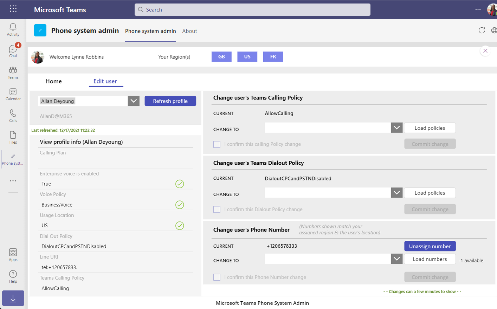
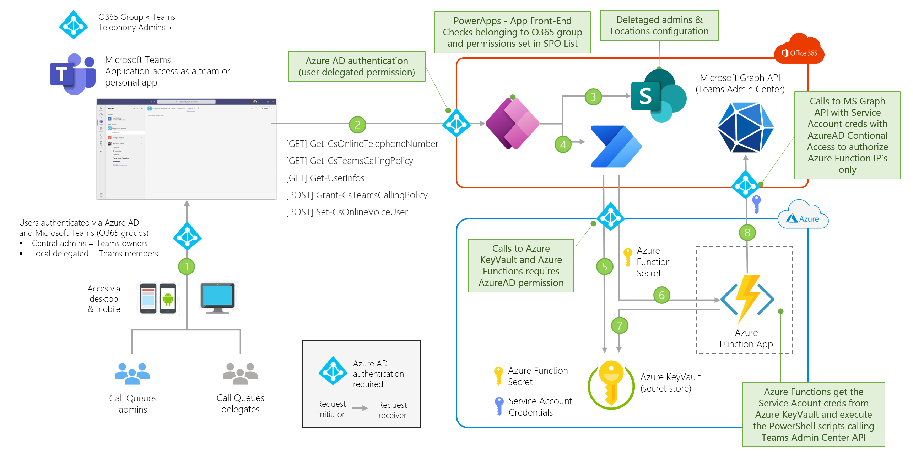

# Microsoft Teams Phone System admin app
A delegated Admin application for Calling Plans (PSTN) phone numbers management

## What's in it for you

Microsoft Teams provides an administration portal to manage the different telephony services for the organization. To access this portal, you need to assign one of the administrator roles defined [here](https://docs.microsoft.com/en-us/MicrosoftTeams/using-admin-roles). To manage the telephony system and assign telephone numbers or voice policies to users, the minimum required  role is "Teams Communications Administrator" - This role is then applied at the scope of the Azure AD tenant, meaning all users in your organization.

While this model works well well operations are managed centrally, it becomes more challenging when an organization needs to delegate these operations at local levels (e.g. per country) - This application provides an answer we a delegated management of the Telephony System based on the location of the users and permissions set for the delegated admins.

As of today, this application supports the following scenarios:
- Assign / Unassign PTSN numbers to a user
- Assign / unassign voice policies to a user
- only Calling Plans (aka PSTN) configuration is supported - Direct Routing is our of scope

This application is a Power Apps deployed into Microsoft Teams. The pre-requisites to deploy the solution are :
- Power Platform licenses (per user / per app) to use Premium connectors
- An Azure Subscription to deploy the required Azure services 
- One Azure AD Premium (P1) license to protect the Service (admin) Account

The architecture of this solution can be adapted to support other scenarios taht require delegated admin management of Teams phone system or any other feature accessible via PowerShell cmdlet or even MS Graph API. 

Here is a screenshot of the application

<!-- 

    

 -->

## Solution overview

### High Level Design

 

1. Users (central and local admins) access the application directly from Microsoft Teams - They are all members of an Office 365 Group with Central admins being the owners of the team and Local admin are members. **Only Central admin can manage Local admin permissions**.
2. The user-interface is provided by a Power Apps. **The Power Apps is only accessbile to the members of the O365 Group**.
3. Local app settings are stored in a SharePoint List - This list is only accessible to Central admins for right access - For each local admin, a list of country codes for delegated permissions is set (e.g. "US" / "FR" / "UK") - A Local admin can only manage users that have the "Usage Location" in Azure AD set to the their delegated country codes and can only manage telephone numbers with a matching "CityCode".
4. Actions validated on the Power Apps trigger a Power Automate flow - The role of the flow (one per API) is to **secure and log** all queries sent to the Teams Admin Center API's.
5. Azure KeyVault is used to securely store the secret and credentials required by the solution. With this design, secrets & credentials management of the "service account" and of the "service principal" can be delegated to a third party that is not an admin of the Team Telephony solution. 
6. Power Automate calls the Azure Function API providing the appropriate credentials.
7. The Azure Function get the "service account" credential that has the "Teams Communications Administrator" role and execute the PowerShell scripts
8. Azure AD conditional access checks the permissions and location of the request.

## How to deploy the solution
**Step 1** - Create a Service Account

- Go to the [Azure AD portal](https://portal.azure.com/#blade/Microsoft_AAD_IAM/UsersManagementMenuBlade/MsGraphUsers) to manage users - Note : you need to have the appropriate permissions in Azure AD to create a new user.
- Add a new user (e.g. "Service Account Teams admin") and save the password - Note : you'll need to reset this password the first time you use this account - Please connect to https://portal.azure.com with the user credentials and provide a new **complex** password - **Store this password in a secured location**
- Go under "assigned roles" and assign the following roles :
  - Directory readers - to read the user profiles
  - Teams communications administration - to manage the Teams telephony system  

**Step 2** - Register an application in Azure AD

- Go to the [Azure AD portal](https://portal.azure.com/#blade/Microsoft_AAD_IAM/ActiveDirectoryMenuBlade/RegisteredApps) to register a new application - Note : you need to have the appropriate permissions in Azure AD to register a new app.
- Click on "New registration"
- Give a name to your app (e.g. "SPN Teams admin") and select "Accounts in this organizational directory only (Contoso only - Single tenant)" and click on "Register"
- Go to "Certificate & Secrets" and create a new secret - **Store this secret in a secured location**

**Step 3** - Deploy the Azure resources

GitHub deploy

ZipDeploy

Here are the information requested for the deployment:
- **resourcePrefix**: the prefix to your Azure resourcecs names
- **Teams-service-account-name** : the UPN of the Service Account created in **step 1** 
- **Teams-service-account-secret** : the password of the Service Account created in **step 1**
<!-- - **Teams-spn-appId** : the clientID of the application registered in **step 2**  -->
<!-- - **Teams-spn-secret** : the secret value of the application registered in **step 2** -->

Check the outputs of the deployment to get the value of Azure Function app code (**AzFuncCode**) needed for the configuration of the Power Automate flows.

**Step 4** - Deploy the Azure resources

## Costs
(only provided as an example, as of December-2021 public prices)

[TO BE COMPLTED] Required licenses and costs estimates

## Contributing

This project welcomes contributions and suggestions.  Most contributions require you to agree to a
Contributor License Agreement (CLA) declaring that you have the right to, and actually do, grant us
the rights to use your contribution. For details, visit https://cla.opensource.microsoft.com.

When you submit a pull request, a CLA bot will automatically determine whether you need to provide
a CLA and decorate the PR appropriately (e.g., status check, comment). Simply follow the instructions
provided by the bot. You will only need to do this once across all repos using our CLA.

This project has adopted the [Microsoft Open Source Code of Conduct](https://opensource.microsoft.com/codeofconduct/).
For more information see the [Code of Conduct FAQ](https://opensource.microsoft.com/codeofconduct/faq/) or
contact [opencode@microsoft.com](mailto:opencode@microsoft.com) with any additional questions or comments.

## Trademarks

This project may contain trademarks or logos for projects, products, or services. Authorized use of Microsoft
trademarks or logos is subject to and must follow
[Microsoft's Trademark & Brand Guidelines](https://www.microsoft.com/en-us/legal/intellectualproperty/trademarks/usage/general).
Use of Microsoft trademarks or logos in modified versions of this project must not cause confusion or imply Microsoft sponsorship.
Any use of third-party trademarks or logos are subject to those third-party's policies.

## Reference documentation

XXX